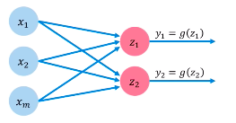
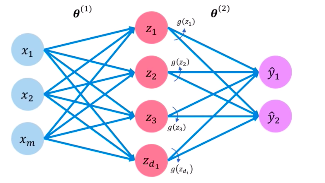
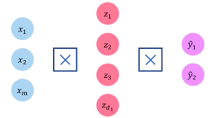
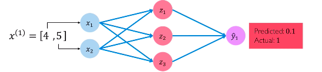
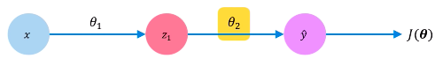
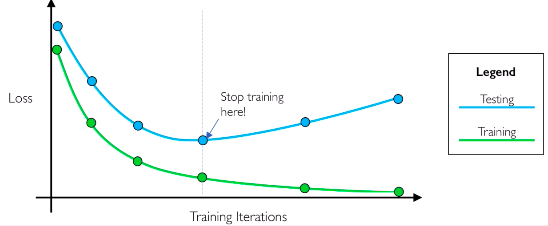

# Lecture 1: Introduction

## Why Deep Learning?
- Hard-coded features are time-consuming, brittle, and not scalable practically
	- Developing heuristics are expensive

## Why Now?
1. Big Data
- Larger datasets, easier to access and store
2. Hardware
- GPUs exist, are highly parallizable
3. Software
- Improved techniques, new models, better frameworks

## The Fundamental Unit of a Neural Network: Perceptron
- Inputs to a perceptron: $x_1...x_n$
- Each input is weighted: $\theta_1...\theta_n$
- $\theta_0$ is a bias unit
- $g(x)$ is a nonlinear function, called an *activation function*
- Formula to calulate output (non-vectorized):

$$ \hat{y} = g(\theta_0 + \sum_{i=1}^{m}{x_i \theta_i}) $$

- Vectorized version:

$$ \hat{y} = g(\theta_0 + X^{\top}\theta) $$

where $X$ is a column vector of inputs and $\theta$ is a column vector of weights

- Examples of the nonlinearity $g(z)$ include:

| Name                         | Function                                                       | Derivative           | TensorFlow Function |
| ---------------------------- | -------------------------------------------------------------- | -------------------- | ------------------- |
| Sigmoid                      | $g(z)=\frac{1}{1+\exp{(-z)}}$                                  | $g'(z)=g(z)(1-g(z))$ | `tf.nn.sigmoid(z)`  |
| Hyperbolic Tangent           | $g(z) = \frac{\exp{(z)} + \exp{(-z)}}{\exp{(z)} + \exp{(-z)}}$ | $g'(z) = 1-g(z)^2$   | `tf.nn.tanh(z)`     |
| Rectified Linear Unit (ReLU) | $g(z)=\max{(0,z)}$                                                               |     $g'(z) = 1$ if $x>0$ or $0$ otherwise                 |          `tf.nn.relu(z)`           |

## Why Activation Functions?
- Introduces non-linearities into the network
- Otherwise the network can only produce linear decisions (regardless of network size)
- Having non-linearities allows modeling of any complex function

## Building Neural Networks Using Perceptrons

### Simplified Pereptron
- Remove the bias term, remove weights for simplicity
- $z = \theta_0 + \sum_{j=1}^{m}{x_j \theta_{j}}$
- Output of perceptron: $y=g(z)$

### Multi-Output Perceptron

- Inputs are still $x_1...x_m$, with each input connected to two units, $z_1$ and $z_2$, which produce outputs $y_1$ and $y_2$
- Formula for each unit is $z_i = \theta_{0,i} + \sum_{j=1}^{m}{x_j \theta_{j,i}}$

### Single-Layer Neural Network

- Not a "deep" NN, it's "shallow"
- Allows for a transformation from input space &rarr; hidden unit space &rarr; output space
- Formula for hidden units is:

$$z_1 = \theta_{0,i}^{(1)} + \sum_{j=1}^{m}{x_j \theta_{j,i}^{(1)}}$$

- Formula for output units is:

$$\hat{y}_{i} =  \theta_{0,i}^{(2)} + \sum_{j=1}^{m}{x_j \theta_{j,i}^{(2)}}$$

- These layers are *fully connected*, meaning every unit in the previous layer is connected to every unit in the next layer
	- Denoted as $\times$, as shown below



### Deep Neural Network
- Just a stack of layers, same method

## Applying Neural Networks
### Example: Will I Pass This Class?
- Two features: $x_1$ (# of lectures attended), $x_2$ (hours spent on final project)
- We want to know if a new person passed or failed the class
- For a feature vector $x^{(1)} = [4, 5]$, we got a prediction 0.1



- Why is this so? This network has never been trained


### Quantifying Loss
- We need to find out how "off" we are from the actual
- The *loss* of a network measures the cost incurred from an incorrect prediction
	- Thought of as a "distance" between actual and predicted output 
- Denoted as $\mathcal{L}(f( x^{(i)}; \theta ), y^{(i)} )$
- Low loss = close to actual

#### Empirical Loss
- *Empirical loss* measures total loss over entire dataset.
- Also known as objective function/cost function/empirical risk
- Calculated as $J(\theta) = \frac{1}{n} \sum_{i=1}^{n}{\mathcal{L}(f( x^{(i)}; \theta ), y^{(i)} )}$

#### Softmax Cross-Entropy Loss
- A type of loss function that can be used with models that predict a value in $(0,1)$ (i.e. a probability)
- Calculated as:

$$J(\theta) = \frac{1}{n} \sum_{i=1}^{n}{ y^{(i)} \log{\Big( f( x^{(i)}; \theta ) \Big)}  + (1-y^{(i)}) \log{\Big( 1 -  f( x^{(i)}; \theta ) \Big)} } $$

- $y^{(i)}$ is actual, while $f( x^{(i)}; \theta )$ is predicted

- In TensorFlow, the loss is found as `loss = tf.reduce_mean( tf.nn.softmax_cross_entropy_with_logits(model.y, model.pred))`

#### Mean Squared Error Loss
- Can be used wih regression models that produce continuous numbers $y \in \mathbb{R}$
- Calculated as:

$$ J(\theta) = \frac{1}{n} \sum_{i=1}^{n}{ \Big( y^{(i)} -  f( x^{(i)}; \theta ) \Big)^2 } $$

- In English: average of actual minus predicted squared
- In TensorFlow, MSE loss is found as: `loss = tf.reduce_mean(tf.square(tf.subtract(model.y, model.pred)))`

## Training Neural Networks
- We want to find the weights $\theta$ that give us the lowest loss
- Our goal: $\theta^{*} = \text{argmin}_{\theta}{J(\theta)}$
- Steps towards gradient descent:
	- Step 1: Randomly initialize $\theta$, usually with distribution $\mathcal{N}(0,1)$
	- Step 2: Compute gradient $\frac{\partial J(\theta)}{\partial \theta}$ (aka $\nabla J(\theta)$)
		- Tells us the direction of highest descent
	- Step 3: Step in opposite of gradient (negate gradient)
	- Step 4: Repeat Steps 1-3 until convergence

- Psuedocode:

1. Initialize weights randomly ~$\mathcal{N}(0, \sigma^2)$
2. Loop until convergence:
3. Compute gradient $\frac{\partial J(\theta)}{\partial \theta}$
4. Update weights $\theta \leftarrow \theta - \eta \frac{\partial J(\theta)}{\partial \theta}$
5. Return weights

- TensorFlow pseudocode:

```python
weights = tf.random_normal(shape, stddev=sigma)
while not converged:
	grads = tf.gradients(ys=loss, xs=weights)
	weights_new = weights.assign(weights - lr * grads)
return weights
```

### How to Compute Gradients?
- Let's look at a simplified example:

- Let's calculate the gradient of $J(\theta)$ with respect to $\theta_2$
	- $\frac{\partial J(\theta)}{\partial \theta} = \frac{\partial J(\theta)}{\partial \hat{y}} * \frac{\partial \hat{y}}{\partial \theta_2}$ because of Chain Rule
- Repeat this for every weight in all layers: backprop

## Neural Networks in Practice: Optimization
- However, most NN cost functions are actually non-convex, making them susceptible to local minima
- Setting the learning rate $\eta$ is extremely hard
	- Small learning rates converge slowly and are susceptible to local minima
	- Large learning rates overshoot and may diverge
	- Stable learning rates converge smoothly while avoiding local minima
- Ways to mitigate?
	- Try a bunch of different $\eta$, see what works
	- Design an adaptive learning rate that "adapts" to the landscape

### Adaptive Learning Rates
- $\eta$ is not fixed
- Can be adjusted based on:
	- how large gradient is
	- how fast learning is happening
	- size of weights
	- and more
- Examples of Adapting LR Algorithms:
	- Momentum (`tf.train.MomentumOptimizer`)
	- Adagrad (`tf.train.AdagradOptimizer`)
	- Adadelta (`tf.train.AdadeltaOptimizer`)
	- Adam (`tf.train.AdamOptimizer`)
	- RMSProp (`tf.train.RMSPropOptimizer`)
- TODO: Read <ruder.io/optimizing-gradient-descent>

## Neural Networks in Practice: Minibatches
- Computing the gradient is computationally expensive on big datasets
- Stochastic GD:
1. Initialize weights randomly ~$\mathcal{N}(0, \sigma^2)$
2. Loop until convergence:
3. Pick single data point $i$
4. Compute gradient estimate $\frac{\partial J(\theta)}{\partial \theta}$
5. Update weights $\theta \leftarrow \theta - \eta \frac{\partial J(\theta)}{\partial \theta}$
6. Return weights

- While it's easy to compute, it's very noisy (stochastic)

- Minibatch GD:
1. Initialize weights randomly ~$\mathcal{N}(0, \sigma^2)$
2. Loop until convergence:
3. Pick batch of $B$ data points
4. Compute gradient estimate $\frac{\partial J(\theta)}{\partial \theta} = \frac{1}{B} \sum_{k=1}^{B} \frac{\partial J_k(\theta)}{\partial \theta}$
5. Update weights $\theta \leftarrow \theta - \eta \frac{\partial J(\theta)}{\partial \theta}$
6. Return weights

- Minibatches will allow us to:
	- Have an accurate estimation of the gradient with smoother convergence and ability to have higher $\eta$
	- Parallelize training to make it faster (especially on GPUs and clusters)

## Neural Networks in Practice: Overfitting
- Underfitting = model does not have the capacity to fully learn data
- Ideal fit = model can generalize well on new data
- Overfitting = too complex and does not generalize well
- Regularization = technique that constrains optimization to discourage overly complex models

### Regularization Using Dropout
- During training, randomly set some activations to 0
	- Usually "drop" 50% of activations in layer
	- Forces network to not rely on any one node
	- TF code: `tf.nn.dropout(hiddenLayer, p=0.5)`

## Regularization Using Early Stopping
- Stop training before overfitting



## Acknowledgements
- Diagrams screenshotted from MIT 6.S191 2018 slides 