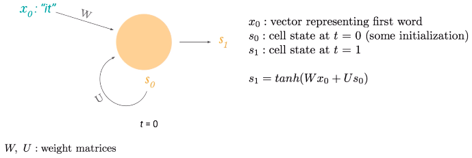
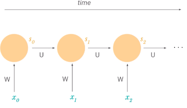

# Lecture 2: Sequence Modeling with Neural Networks

## Examples of Sequences
- Sentences: "This morning I took a dog for a walk"
- Medical signals: consist of many measurements
- Waveforms: many measurements
- QAS and Machine translation are sequence modelling taks

## Example: Sequence Modeling Problem
- Predict the next word in a sentence
- "Given these words, what comes next?"
- Has variable length input and output
- Can we use a fixed window?
	- Use previous 2 words, one-hot encode them
	- But we can't predict long-term dependencies (e.g. need information from beginning of sentence)
- Can we use the entire sequence as a set of counts? ("bag of words" method)
	- Count of each word appearing (fixed length vector)
	- But we lose temporal sequence information
- Can we use a really large fixed window?
	- Use previous 7 words
	- However, there's no parameter sharing (words' position parameters are not being shared)
- We need the following things:
	- Dealing with variable-length sequences
	- Maintain sequence order
	- Keep track of long-term dependencies
	- Share parameters across sequence
- Solution: RNNs

## The Recurrent Neural Network
- Structure is similar, but each unit "remembers" its old state

- Hidden unit is activated as $\tanh{(Wx_0 + Us_0)}$
- Subscript = time step ($s_0$ is initial state, $s_1$ new state at $t=1$)
- W and U don't change across time steps
	- Helps us deal with parameter sharing and variable length sequences

- $s_n$ can have info from previous time steps
	- Each cell state is function of previous cell state

## Training RNNs
- Backpropagation with a time component
- Since we have an input at each timestep, we have a loss at each time step
	- $\mathcal{L}_t = J_t(\Theta)$
- Total loss: $J(\Theta) = \sum_t{J_t(\Theta)}$
- Total gradients: $\frac{\partial J}{\partial P} = \sum_t{\frac{\partial J_t}{\partial P}}$
- To get gradient over time:
$$\frac{\partial J_2}{\partial W} = \sum_{k=0}^{t}{\Bigg( \frac{\partial J_t}{\partial y_t} \frac{\partial y_t}{\partial s_t}} \frac{\partial s_t}{\partial s_k} \frac{\partial s_k}{\partial W}\Bigg)$$

## Issues With Training RNNs
### Vanishing Gradient
- As the gap between timesteps get bigger, the product needed to find $J$ gets longer
	- We get smaller gradients from further back time-steps
	- Parameters become biased to capture short-term dependencies
- Solution: Use ReLU or similar
- Solution: Initialize $W$ to $I_n$, and biases to zeroes
- Solution: Use a more complex cell
	- Use a LSTM/GRU/etc. cell (is a complex unit with gates)

### Solution: LSTM Cells
- Forget irrelevant parts of previous state
- Selectively update cell state values
- Output certain parts of cell state

### Why LSTMs?
1. Forget gate allows info to pass unchanged
2. Cell state is separate from output
3. $s_j$ depends on $s_{j-1}$ using addition, meaning no long products

## Possible Tasks
- Music generation
- Machine translation
	- 2 RNNs