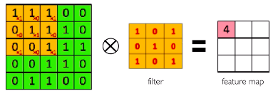
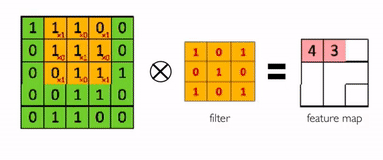
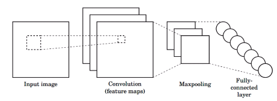
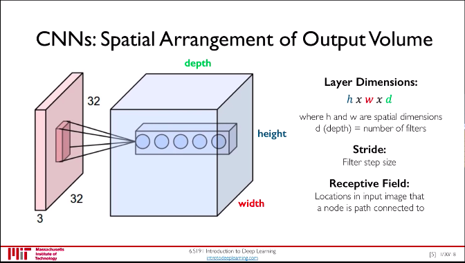
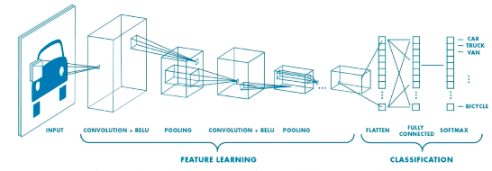
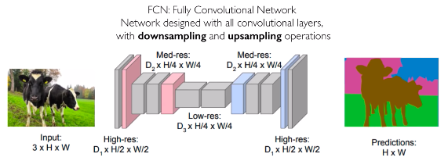
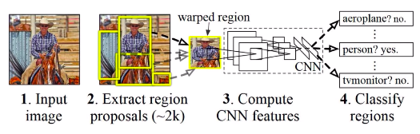
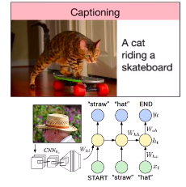

# Lecture 3: Convolutional Neural Networks

## How Do Computer Process an Image?
- For a computer, images, are just numbers
	- Grayscale images: 2D array
	- RGB images: 3D array

## Tasks in Computer Vision
- **Regression**: output is continuous
- **Classification**: output is a class label (probability)

## Learning Feature Representations
- Can we learn a hierarchy of features directly from data instead on "hand-engineering"?

## Learning Visual Features Using NNs
### Using a Fully Connected Neural Network
- Input: $x \in \mathbb{R}^n$, 2D image "unwrapped" into vector of pixel intensities
- Connect neural in hidden layer to all neurons in input layer
- We lose spatial information
- Lots and lots of parameters

### Using Spatial Structure
- Input: $x \in \mathbb{R}^{n \times m}$, 2D image as array of pixel intensities
- Connect patches of input to neurons in hidden layer
	- Neuron only "sees" region of vaues
- Connect patch in input layer to single neuron in subsequent layer, use a sliding window to define these connections
- How does *weighting* come in?

### Applying "Filters" to Learn Visual Features
1. Apply a set of weights (filter) to extract **local features**
2. Use **multiple filters** to extract different features
3. Spatially **share** parameters of each filter (features that matter in one part of input should matter everywhere)

### Feature Extraction With Convolution
- Filter of size $4 \times 4$, means 16 different weights
- Apply this filter to $4\times4$ patches in input
- Shift by 2 pixels for next patch
- This "patchy" operation = **convolution**
- Convolution is an element-wise product between patch of input matrix and a filter matrix, then add all outputs
	- Define input patch as $P$ and filter as $F$, convolution is defined as $\text{sum}(P \otimes F)$
- What if we want to, say, compute convolution of $5\times5$ image and $3\times3$ filter?
	- We slide the $3\times3$ filter over the input image and perform convolution similarly

Step 1:

Steps 2-9:

## CNNs
### CNNs for Classification
1. Convolution: Apply filters with learned weights to generate feature maps
2. Non-linearity: often ReLu
3. Pooling: Downsampling operation on each feature map
- Train model with image data, learn weights in convolutional layers.

- For a neuron in hidden layer:
	- Takes inputs from patch that the neuron "sees"
	- Compute weighted sum, apply bias

- For $4\times4$ filter, convolution is defined as:

for neuron $(p,q)$ in hidden layer:

$$\sum_{i=1}^{4}\sum_{j=1}^{4} \theta_{ij} x_{i+p, j+q} + b$$

where $\theta_{ij}$ is a matrix of weights

### Spatial Arrangement of Output Volume

### Introducing Non-Linearity
- Apply after every convolution operation
- Usually use ReLU

### Pooling
- Downsampling but preserving spatial invariance
- Maxpooling: find "max" value in chunk

### CNN Image Classification Pipeline

- Use cross-entropy loss in backprop

# Beyond Classification
- Semantic segmentation: segment an image into multiple categories
- Object detection: detect objects in image
- Image captioning: generate captions of image

## Semantic Segmentation with FCNs
- Fully Convolutional Network
- Downsampling to upsampling

## Object Detection With R-CNNs

## Image Captioning Using RNNs

