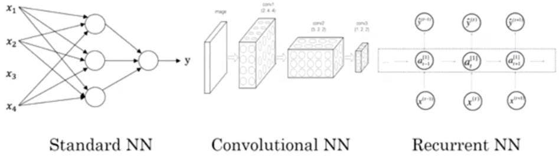

# 2.2: Supervised Learning With Neural Networks

- Neural networks are super hyped, and they've mainly used for supervised Learning

## What is supervised learning?

- A problem where you're given some features $x$ and we predict some output $y$.

- Some examples of where NNs have been used:

|  Input  |  Output  | Application | Neural Network Type/Arch |
|--------|--------|----------------|------|
|home features|price|real estate|standard|
|ad,user info|click on ad? (binary)|online ads|standard|
|image|object (1-1000)|photo tagging, computer vision|CNN|
|audio|text transcript|speech recognition|RNN|
|english|chinese|machine translation|RNN|
|image, LIDAR info|position of other cars|self-driving cars|custom/complex|

- Different types of NNs are used for different applications, as seen above.
- Visualization of the different types:

