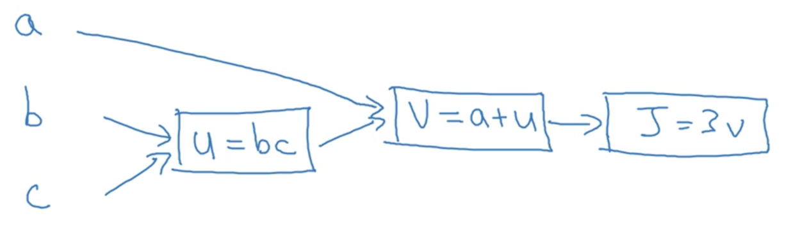

# 1.7: Computation Graph

- The computation graph explains why a NN consists of a forward and a backward
pass

## Simpler Example
- Let's say we have a function $J(a,b,c) = 3(a+bc)$
  - To compute this function, we have to do three different steps:

    1. Multiply $b$ and $c$ and store it into temp variable $u$ ($u = bc$)
    2. Add $a$ and the temp variable $u$ and store into temp variable $v$ ($v = a+u$)
    3. Multiply $v$ by $3$ and return $J$

  - These steps can be expressed in terms of a *computation graph*, as follows:
      
    
- Forward passes for computation graphs compute values, and backward passes are used to calculate derivatives
